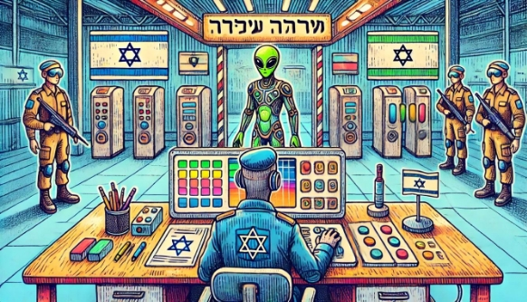
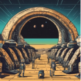
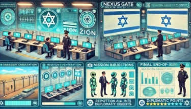
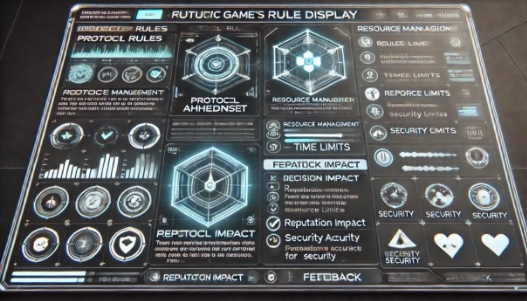

NEXUS GATE: ZION 

- **תגית שיווקית:  "בעולם של גבולות, הדיפלומטיה היא הכוח העליון."**
- **מהות המשחק: המשחק הוא סימולציה  דיפלומטית  המתרחשת בעתיד הרחוק, בו ישראל משמשת כמוקד מפגש בין-גלקטי. השחקן נכנס לנעלי קצין במחסום מרכזי ועתידני, שם הוא בודק זהויות , מאמת מסמכים, מנהל דיאלוגים  עם בני אדם וחוצנים, ומקבל החלטות מוסריות  שמעצבות את היחסים בין הפלגים השונים. כל בחירה מכתיבה את כיוון  העלילה ומשפיעה על יחסי ישראל עם התרבויות  השונות, עם דגש על אתיקה, דיפלומטיה  וביטחון.**  

- **.(PC ) פלטפורמה: המשחק מיועד למחשב רגיל**

- **תמונת מסך רעיונית:**  

**רכיבים רשמיים** 

1. **שחקנים:** 

**קהל יעד: המשחק מיועד לבני 16 ומעלה, עם התאמה לשחקנים שאוהבים להתעמק בהחלטות אסטרטגיות  ובדילמות  מוסריות  בסביבה עלילתית  עשירה. הוא פונה לשחקנים בעלי רמות ניסיון  בינוניות  ומעלה, שכבר מכירים  משחקים בהם נדרשים  שיקולים  אתיים וניהול  מערכות יחסים מורכבות. בנוסף, הוא מתאים לאלה המתעניינים  במדע בדיוני, דיפלומטיה , ובמשחקים מונחי סיפור ומתח תרבותי.** 

**מספר שחקנים: המשחק מיועד לשחקן יחיד, המאפשר חוויה פרטנית וממוקדת, בה השחקן בוחן כל החלטה באופן אישי. חוויית  הסולו מעצימה את תחושת האחריות של השחקן כקצין המחסום ומאפשרת לו להתעמק במערכת היחסים עם כל דמות שמגיעה לבדיקה.** 

**דפוסי אינטראקציה: המשחק מתמקד באינטראקציות  נרטיביות , בהן השחקן מתקשר עם דמויות  שונות ובוחן את עמדותיו  ואת החלטותיו המוסריות  מול כל דמות. המשחק מאפשר לשחקן לקחת החלטות אישיות  שמעצבות את הסיפור והיחסים עם פלגים גלקטיים  מגוונים . האינטראקציה  מבוססת על דיאלוגים  ובחירות  מוסריות, ללא אלמנטים תחרותיים  או שיתופיים.**  

2. **יעדים:**   

**השחקן, בתפקיד קצין המחסום, נדרש להשיג מספר מטרות מרכזיות :** 

**אימות זהויות: השחקן צריך לאמת מסמכים ולוודא  את זהותם של כל המבקרים על מנת לאשר או לדחות את כניסתם.**  

- **ניהול אינטראקציות  דיפלומטיות : במפגשים עם מבקרים חשובים או עם דמויות  בעלות השפעה, על השחקן לקבל החלטות דיפלומטיות  שישפיעו על היחסים עם פלגים גלקטיים  שונים.** 
- **שמירה על ביטחון המחסום: השחקן צריך לוודא שלא מתבצעות הברחות או פעולות שמסכנות את הביטחון, תוך איזון בין ביטחון לבין שמירה על יחסים דיפלומטיים .** 
- **קבלת החלטות מוסריות: במקרים של דילמות  מוסריות, על השחקן להחליט באיזו גישה לנקוט - למשל, האם להקל על מבקר חשוד או לעכב אותו לבדיקה מקיפה יותר.**  

**השגת המטרות מתבצעת על ידי שמירה על רמת מוניטין  גבוהה עם הפלגים השונים, שמירה על סדר וביטחון  במחסום, ואיזון  נכון בין ציות לפרוטוקולים  לבין התנהלות דיפלומטית .** 

**איך המשחק מודיע לשחקן את יעדיו:** 

- **הודעה בתחילת כל יום: בתחילת כל יום עבודה, השחקן יקבל תדריך על המטרות המרכזיות  של היום ועל המבקרים הצפויים להגיע. התדריך יופיע על מסך ראשי בעמדת הפיקוח של השחקן ויכלול  מידע על דמויות  מיוחדות  שיגיעו  לבדיקה, וכן פרטים על משימות ייחודיות  לאותו יום.** 
- **יומן משימות: מטרות השחקן ומעקב אחרי המשימות הנדרשות  יוצגו ביומן משימות שניתן לפתוח בכל שלב במשחק. היומן מתעדכן בהתאם לפעולותיו  של השחקן ומציג לו משימות שבוצעו ומשימות  שעדיין יש להשלים.** 

- **פידבק בזמן אמת: במהלך כל אינטראקציה  עם מבקרים, המשחק מספק לשחקן פידבק מידי על ההחלטות שהוא מקבל - למשל, אם הוא מאפשר למבקר בעל זהות חשודה לעבור, או אם הוא מחמיר מדי בבדיקה. הפידבק המיידי  עוזר לשחקן להבין את השפעת החלטותיו על המטרות שלו.**  
3. **תהליכים:**  
**תחילת המשחק (30 השניות הראשונות):**  

- **מי עושה מה: בתחילת המשחק, השחקן נכנס לתפקיד קצין המחסום ומקבל תדריך יומי קצר. התדריך כולל את מטרות היום (כגון ביקור של דמות בכירה או אירוע דיפלומטי חשוב) ומספק רקע על הפלגים הנמצאים ביחסים מורכבים עם תחנת המחסום. בנוסף, השחקן לומד להכיר את הכלים הבסיסיים לאימות זהויות ולבדיקת פריטים.**  
- **איפה ומתי: במהלך 30 השניות הראשונות, השחקן נמצא בעמדת הפיקוח שלו וצופה במסך המציג את משימות היום ואת הפרטים על הדמויות הצפויות להגיע.**
- **כיצד: השחקן משתמש בעכבר ובמקלדת כדי לעבור על הוראות התדריך, לקבל גישה לכלים, ולשלוט בבקרות הבדיקה. כל כלי או פרוטוקול חשוב מוסבר בקצרה באמצעות טקסט או חלון עזרה על המסך.**  

**תהליך ליבה (לולאת משחק):**   
- **מי עושה מה: השחקן מקבל מבקרים בעמדת המחסום ובודק את מסמכיהם.**  
- **כל מבקר עובר תהליך בו השחקן:**  
- **בדיקת זהות: הסורק הראשי מציג את הפרטים האישיים של המבקר. השחקן יכול לבחור לאמת את המידע או לשאול שאלות נוספות במידת הצורך.**  
- **בדיקת פריטים: אם מתעורר חשד, השחקן יכול לסרוק פריטים נוספים של המבקר (כגון דרכון, תיק או מסמכים נוספים).**  
- **אינטראקציה ובחירה: השחקן מנהל דיאלוג מבוסס בחירה עם המבקר, הכולל שאלות נוספות או בירור על רקע תרבותי/דיפלומטי.**  
- **איפה ומתי: התהליך מתרחש בעמדת הבדיקה לאורך כל היום, כשהשחקן מטפל בכל מבקר לפי הזמן שלו. כל אינטראקציה אורכת מספר דקות, והמשחק עוקב אחר הזמן שעבר.**
- **כיצד: השחקן משתמש בעכבר **

  **ובמקלדת כדי לבדוק מסמכים,** 

  **לסרוק פריטים, ולהחליט מה יקרה** 

  **עם כל מבקר - האם לאשר כניסה,** 

  **לדחות, או לעכב לבדיקה נוספת.**  

- **סיום המשחק (סיום היום):**  
- **מי עושה מה: בסיום היום, השחקן מקבל** 

  **דו"ח מסכם על החלטותיו ועל השפעתן על** 

  **היחסים עם הפלגים השונים. הדו"ח מספק** 

  **ניתוח על נקודות תורפה אפשריות בבדיקות** 

  **שהשחקן ביצע, ומראה את השפעת החלטותיו על רמת הביטחון והדיפלומטיה בתחנה.**

- **איפה ומתי: בסוף כל יום עבודה, השחקן עובר לדו"ח הסיכום באזור ייעודי בעמדת הפיקוח.**
- **כיצד: באמצעות חלונות אינטראקטיביים, הדו"ח מציג לשחקן את התוצאות עם גרפיקה שמסכמת את הנקודות החיוביות והשליליות ביום. השחקן לומד מהדו"ח מה היו השלכות הבחירות שלו ומה כדאי לשפר ביום הבא.**  
4. **חוקים:** 
- **צורך לציית לפרוטוקולים : השחקן חייב לפעול לפי פרוטוקולים  מוגדרים  של בקרת גבולות, הכוללים  בדיקת מסמכים, סריקת פריטים, ושאלות הכרחיות. חריגה מהפרוטוקולים  (כגון מתן מעבר ללא אימות מסמכים או דילוג על בדיקה הכרחית) עלולה להוביל לסנקציות ולהשפיע לרעה על רמת המוניטין  והאמינות  של השחקן.** 
- **ניהול משאבים מוגבלים: השחקן מחויב לנהל את המשאבים העומדים  לרשותו, כולל זמן מוגבל לבדיקה של כל מבקר, טכנולוגיות  בדיקה משודרגות  ויכולת  לסרוק פריטים בצורה מהירה אך לא תמיד יסודית.** 
- **שמירה על ביטחון: כל כניסה חשודה חייבת להיבדק בקפידה. הכנסת מבקר בעל חשד להברחה או כוונה לפגוע יכולה לגרום לבעיות  אבטחה חמורות.**  

**חוקים לקביעת תוצאות של פעולות במשחק :** 

- **השפעה על מערכות יחסים: כל בחירה תשפיע על רמת המוניטין  של השחקן עם הפלגים השונים. החלטות הדוחות או מאפשרות כניסה למבקרים ייחודיים , תורמות ליחסים דיפלומטיים  או יוצרות  מתח בהתאם לאופי הבחירה.** 
- **פידבק על דיוק והגינות: תוצאות הבדיקות יקבעו על פי הדיוק בו השחקן עוקב אחר הפרוטוקולים . החלטות מוצלחות (כמו זיהוי  הברחה או פתרון בעיה דיפלומטית ) יזכו את השחקן בנקודות  מוניטין  ושדרוגים , בעוד שפעולות פזיזות  עלולות להוביל להשלכות שליליות .** 
- **קידום או עיכוב על פי בחירות מוסריות: פעולות מוסריות  עשויות  להשפיע על מצב המחסום ועל תהליך העבודה היומי - כמו למשל עיכוב או קידום מבקרים מסוימים על פי מידת האמפתיה או החשדנות של השחקן.** 

**איך השחקן ילמד את חוקי המשחק:**  

- **הדרכת פתיחה: בתחילת המשחק, השחקן עובר הדרכה קצרה שמסבירה את הפרוטוקולים  והכללים  הבסיסיים של המחסום, כולל התהליכים  החשובים והכלים שבשימוש.** 
- **רמזים  במהלך המשחק: השחקן יקבל רמזים  והנחיות  בשלביה הראשונים  של כל משימה ייחודית , המסבירים  את החוקים והכללים  הנדרשים  להשלמתה.** 
- **משוב לאחר כל יום עבודה: בסיום כל יום, השחקן יקבל דו"ח עם פידבק על פעולותיו, תוך ציון נקודות לשיפור או הפרות שבוצעו.**  

  

5. **משאבים:** 
- **מוניטין: רמת המוניטין  של השחקן עם הפלגים השונים. כל החלטה משפיעה על מערכות היחסים הדיפלומטיות  של ישראל עם קבוצות גלקטיות מגוונות.** 
- **טכנולוגיות  ושדרוגים : כלים לשדרוג  המתקנים והיכולות  של השחקן, כמו סורקים מתקדמים או מערכות לזיהוי  חשדות. השדרוגים  משפרים את יכולת השחקן לזהות זהויות  ולהתמודד עם מצבים מורכבים.** 
- **זמן: המשאב שזמין לכל משמרת. זמן מוגבל עבור כל אינטראקציה  משפיע על יכולת השחקן להתמקד בבדיקות מעמיקות או לזרז תהליכים כדי להכניס יותר מבקרים.** 
- **השפעה פוליטית: כוח דיפלומטי שמאפשר לשחקן לקבל החלטות השפעתיות, כמו חנינה מיוחדת או עיכוב בלתי צפוי של מבקר חשוב .**  

**כיצד המשאבים יועילו  לשחקן:** 

- **מוניטין  גבוה: מוניטין  טוב עם פלגים שונים יאפשר לשחקן לקבל שיתופי פעולה ובונוסים . למשל, פלג שנמצא ביחסים טובים עשוי להמליץ על כניסה מהירה של מבקרים, מה שיפחית את עומס העבודה.** 
- **שדרוגים : מאפשרים לשחקן לבדוק מבקרים בצורה מהירה ומדויקת  יותר, ומפחיתים את הסיכון להחמצת פרטים חשובים.** 
- **זמן: ניהול נכון של הזמן מאפשר לשחקן לבדוק יותר מבקרים בכל משמרת, להרוויח  יותר נקודות ולהתקדם במהירות  רבה יותר.** 
- **השפעה פוליטית: כוח דיפלומטי יאפשר לשחקן לפתור מצבים מסובכים בדרכים  יצירתיות  ולשפר את מעמדו בקרב פלגים גלקטיים.** 

**דרכים  להשגת משאבים:** 

- **ביצועים  טובים בבדיקות: כל בדיקה מוצלחת תעניק לשחקן נקודות מוניטין  ושדרוגים  בהתאם לרמת הדיוק שלו.** 
- **יחסים טובים עם פלגים: אינטראקציות  חיוביות  עם פלגים מסוימים יובילו  לבונוסים  של מוניטין  ושל משאבים, כמו תמיכה טכנולוגית  או זמן נוסף.** 
- **בחירות מוסריות: החלטות נכונות  מבחינה מוסרית וביצוע  תפקיד עם דגש על אתיקה יובילו  להשפעה פוליטית מוגברת.**  

**שמירה על נדירות  המשאבים:**  

- **עלות גבוהה לשדרוגים : שדרוגים  דורשים  נקודות מוניטין  רבות, ולכן השחקן צריך לבחור היטב מתי וכיצד לשדרג.** 
- **הגבלת הזמן: זמן הוא משאב יקר במשחק, כך שכל אינטראקציה  לוקחת זמן ומשפיעה על כמות הבדיקות שהשחקן יכול לבצע.** 
- **צורך במוניטין  מול פלגים שונים: על מנת להשיג השפעה פוליטית ומשאבים חשובים, השחקן חייב לשמור על יחסים טובים עם פלגים שונים, מה שמגביל את כמות המשאבים הזמינה.** 

**הצגת המשאבים לשחקן:** 

- **חלון תצוגה קבוע: המשחק יכלול חלון ייעודי  על המסך שמציג את רמת המוניטין , הזמן הנותר למשמרת, ואת רמת ההשפעה הפוליטית  של השחקן.** 
- **סיכום יומי: בסיום כל יום, השחקן יקבל דו"ח מפורט שמציג את כמות המוניטין  שהרוויח , השדרוגים  החדשים, וכל שיפור במעמדו בקרב הפלגים השונים.** 
